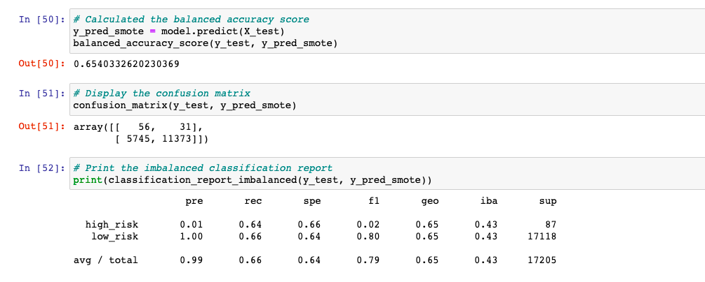
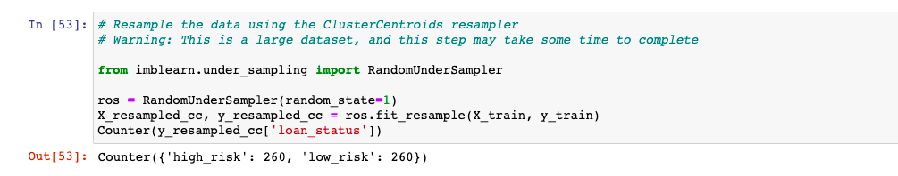
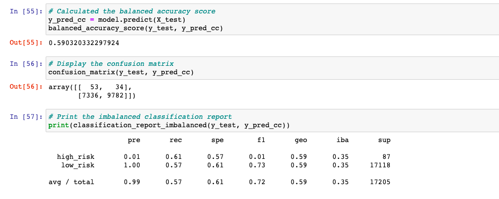
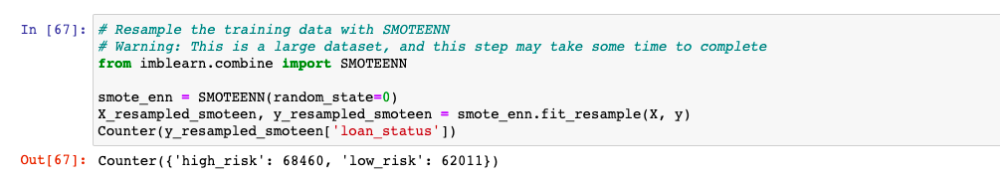
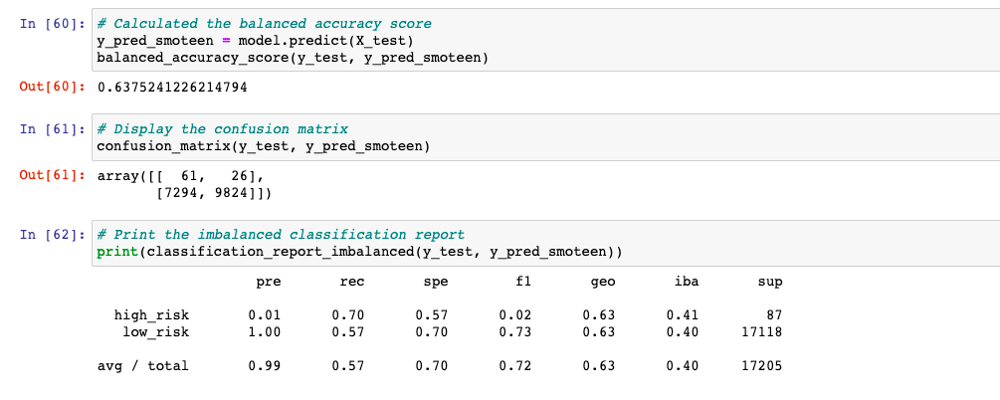
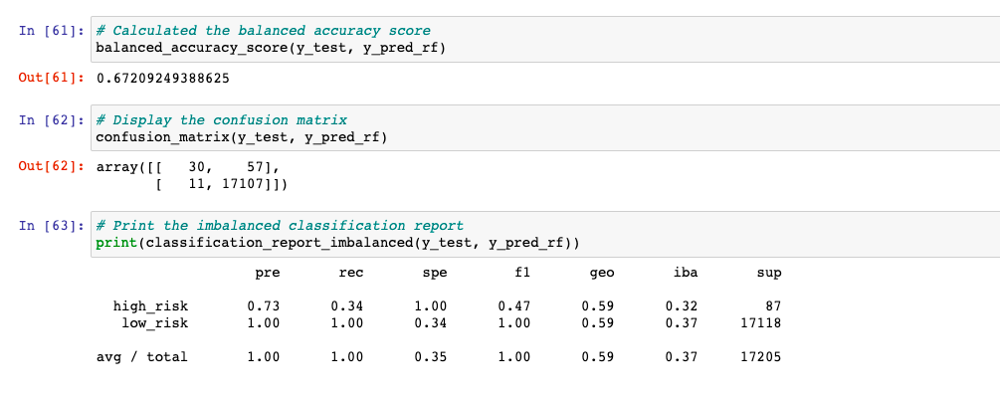
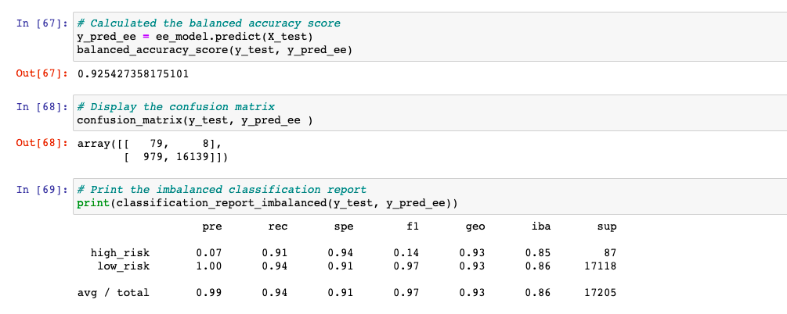

# Credit Risk Analysis

## Background

Credit risk is an inherently unbalanced classification problem, as good loans easily outnumber risky loans. Therefore, you’ll need to employ different techniques to train and evaluate models with unbalanced classes. Jill asks you to use imbalanced-learn and scikit-learn libraries to build and evaluate models using resampling.

## Overview of Project

### Purpose

Using the credit card credit dataset from LendingClub, a peer-to-peer lending services company, you’ll oversample the data using the RandomOverSampler and SMOTE algorithms, and undersample the data using the ClusterCentroids algorithm. Then, you’ll use a combinatorial approach of over- and undersampling using the SMOTEENN algorithm. Next, you’ll compare two new machine learning models that reduce bias, BalancedRandomForestClassifier and EasyEnsembleClassifier, to predict credit risk. Once you’re done, you’ll evaluate the performance of these models and make a written recommendation on whether they should be used to predict credit risk.

## Analysis And Challenges

## Methodology: Analytics Paradigm

#### 1. Decomposing the Ask

* Deliverable 1: Use Resampling Models to Predict Credit Risk
* Deliverable 2: Use the SMOTEENN Algorithm to Predict Credit Risk
* Deliverable 3: Use Ensemble Classifiers to Predict Credit Risk

#### 2. Identify the Datasource
* LoanStats_2019Q1.csv for 68817 records. Dataset is imbalanced with 68470 low risk and 347 high risk.

### 3. Define Strategy & Metrics
**Resource:** Python, numpy, pandas, pathlib, collections, sklearn, imblearn

#### 4. Data Retrieval Plan
NA

#### 5. Assemble & Clean the Data
* Null values dropped and columns name changed so Data Scientist can understand the values better.
* Random State = 1, used as fixed seed for all models.

#### 6. Analyse for Trends

The analysis is indicated below in [Analysis](#analysis)

#### 7. Acknowledging Limitations
Need more knowledge on statistics.

#### 8. Making the Call:
The "Proper" Conclusion is indicated below in [Summary](#summary)

## Analysis

From the total loans of  68817 there are:
* low risk: 68470
* high risk: 347

### Oversampling
#### Naive Random Oversampling

>Random Oversampling

Random oversampling produced 51352 high_risk samples to match low_risk.  

>Random Oversampling Results

* Balance accuracy score of 0.6595 means that this model correctly classify 65.9% the loans correctly according to high and low risks.
* Precision score
  - high risk: 0.01 means that this model correctly classify and flags 1% high risk loans. That means 99% of the flagged high risk were not actually high risk.
  - low risk: 1.00  means that this model correctly classify and flags 100% low risk loans
* Recall (sensitivity) score
  - high risk: 0.64 means that this model correctly classify and flags 64% high risk loans. That means 36% high risk were not flagged.
  - low risk: 0.68  means that this model correctly classify and flags 68% low risk loans

#### SMOTE (Synthetic Minority Over-sampling TEchnique) Oversampling

>SMOTE Oversampling

SMOTE oversampling produced 51352 high_risk samples to match low_risk.  

>SMOTE Oversampling Results

* Balance accuracy score of 0.654 means that this model correctly classify 65.4% the loans correctly according to high and low risks.
* Precision score
  - high risk: 0.01 means that this model correctly classify and flags 1% high risk loans. That means 99% of the flagged high risk were not actually high risk.
  - low risk: 1.00  means that this model correctly classify and flags 100% low risk loans
* Recall (sensitivity) score
  - high risk: 0.64 means that this model correctly classify and flags 64% high risk loans. That means 36% high risk were not flagged.
  - low risk: 0.66  means that this model correctly classify and flags 66% low risk loans

### Undersampling

>Undersampling

 Undersampling produced 260 low_risk samples to match high_risk.   

>Undersampling Results

* Balance accuracy score of 0.590 means that this model correctly classify 59% the loans correctly according to high and low risks.
* Precision score
  - high risk: 0.01 means that this model correctly classify and flags 1% high risk loans. That means 99% of the flagged high risk were not actually high risk.
  - low risk: 1.00  means that this model correctly classify and flags 100% low risk loans
* Recall (sensitivity) score
  - high risk: 0.61 means that this model correctly classify and flags 61% high risk loans. That means 39% high risk were not flagged.
  - low risk: 0.57  means that this model correctly classify and flags 57% low risk loans

### SMOTEENN: Combination (Over and Under) Sampling

>Combination Sampling

 SMOTEENN produced 68460 high_risk samples and 62011 low_risk samples. 

>Combination Sampling Results

* Balance accuracy score of 0.6375 means that this model correctly classify 63.7% the loans correctly according to high and low risks.
* Precision score
  - high risk: 0.01 means that this model correctly classify and flags 1% high risk loans. That means 99% of the flagged high risk were not actually high risk.
  - low risk: 1.00  means that this model correctly classify and flags 100% low risk loans
* Recall (sensitivity) score
  - high risk: 0.70 means that this model correctly classify and flags 70% high risk loans. That means 30% high risk were not flagged.
  - low risk: 0.57  means that this model correctly classify and flags 57% low risk loans

### Balanced Random Forest Classifier

>Balanced Random Forest

* Balance accuracy score of 0.672 means that this model correctly classify 67.2% the loans correctly according to high and low risks.
* Precision score
  - high risk: 0.73 means that this model correctly classify and flags 73% high risk loans. That means 27% of the flagged high risk were not actually high risk.
  - low risk: 1.00  means that this model correctly classify and flags 100% low risk loans
* Recall (sensitivity) score
  - high risk: 0.34 means that this model correctly classify and flags 34% high risk loans. That means 66% high risk were not flagged.
  - low risk: 1  means that this model correctly classify and flags 100% low risk loans

### Easy Ensemble AdaBoost Classifier

>Easy Ensemble AdaBoost

* Balance accuracy score of 0.6375 means that this model correctly classify 63.7% the loans correctly according to high and low risks.
* Precision score
  - high risk: 0.01 means that this model correctly classify and flags 1% high risk loans. That means 99% of the flagged high risk were not actually high risk.
  - low risk: 1.00  means that this model correctly classify and flags 100% low risk loans
* Recall (sensitivity) score
  - high risk: 0.70 means that this model correctly classify and flags 70% high risk loans. That means 30% high risk were not flagged.
  - low risk: 0.57  means that this model correctly classify and flags 57% low risk loans

## Summary

## Appendix

### References

* Random Forest : https://imbalanced-learn.org/stable/references/generated/imblearn.ensemble.BalancedRandomForestClassifier.html

* Easy Ensemble : https://imbalanced-learn.org/stable/references/generated/imblearn.ensemble.EasyEnsembleClassifier.html
